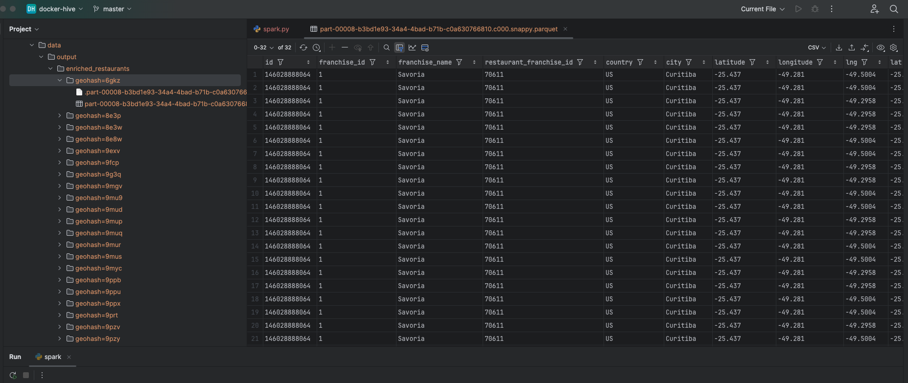

# Spark ETL Job Documentation

This documentation provides an overview of the Spark ETL job designed to process restaurant and weather data, integrate the datasets, and save the enriched results efficiently. The process is optimized for handling large-scale data while ensuring idempotence and partitioning.

---

## Purpose

The ETL (Extract, Transform, Load) job:
- Reads restaurant data from CSV files and weather data from Parquet files.
- Processes and enriches the data by:
  - Filling missing latitude/longitude values using the OpenCage Geocoding API.
  - Generating geohashes based on latitude and longitude.
  - Joining restaurant data with weather data using geohashes.
  - Deduplicating the final dataset.
- Saves the enriched data in Parquet format, partitioned by geohash for efficient querying.

---

## Prerequisites

1. **Python Libraries**:
   - `pyspark`
   - `requests`
   - `python-dotenv`
   - `geohash2`

2. **Environment Setup**:
   - Create a `.env` file with the following content:
     ```plaintext
     API_KEY=your_opencage_api_key
     ```

3. **Input Data**:
   - Restaurant data in CSV format located at `data/restaurants`.
   - Weather data in Parquet format located at `data/weather`. The weather data directory supports nested folders and files.

---

## How It Works

### 1. **Reading Data**
- The script reads all CSV files from the `data/restaurants` directory and all Parquet files recursively from the `data/weather` directory.
- A geohash column is generated for the weather data based on latitude (`lat`) and longitude (`lng`).

### 2. **Processing Data**
- Missing latitude and longitude values in the restaurant data are filled using the OpenCage Geocoding API, based on the `city` and `country` fields.
- Geohashes are generated for the restaurant data using the `latitude` and `longitude` columns.
- The restaurant data is joined with weather data using the `geohash` column.
- Deduplication is performed to ensure there are no duplicate rows in the final dataset.

### 3. **Saving Data**
- The enriched dataset is saved in Parquet format, partitioned by the `geohash` column.
- Snappy compression is applied for efficient storage.

---

## Key Functions

### `read_data()`
Reads all input files and generates geohashes for the weather data.

### `process_data()`
Performs the following operations:
- Fills missing latitude/longitude values using a UDF and the OpenCage Geocoding API.
- Generates geohashes for restaurant data.
- Joins the restaurant and weather datasets using geohash.
- Deduplicates the resulting dataset.

### `write_data()`
Writes the final enriched dataset to the specified output path in Parquet format, partitioned by geohash. It also prints the first 100 rows of the processed data for verification.

---

## Usage

1. Ensure all dependencies are installed (use `requirements.txt`):
   ```bash
   pip install -r requirements.txt
   ```
2. Run the ETL job:
   ```bash
   python spark.py
   ```
3. Run tests (optional):
   ```bash
   python test_spark.py
   ```
4. The output will be saved in `data/output/enriched_restaurants`, partitioned by geohash.

#### Result should like this:


---

## Example Directory Structure

```
project-directory/
├── data/
│   ├── restaurants/
│   │   ├── file1.csv
│   │   ├── file2.csv
│   └── weather/
│       ├── 10-2016/
│       │   ├── day-01/
│       │   │   ├── part-1.parquet
│       │   │   └── part-2.parquet
│       │   └── day-02/
│       │       ├── part-1.parquet
│       │       └── part-2.parquet
├── your_etl_script.py
├── requirements.txt
└── .env
```

---

## Troubleshooting

### 1. **Warnings During Writing**
If you see warnings like `RowBasedKeyValueBatch`, ensure you:
- Increase executor memory: `spark.executor.memory=4g`.
- Optimize partitions using `repartition()` or `coalesce()`.

### 2. **Performance Issues**
- Tune `spark.sql.shuffle.partitions` and `spark.executor.memory`.
- Ensure the cluster has sufficient resources.

### 3. **API Key Errors**
- Verify the `.env` file is correctly set up with a valid OpenCage API key.
- Check the API key usage limits.

